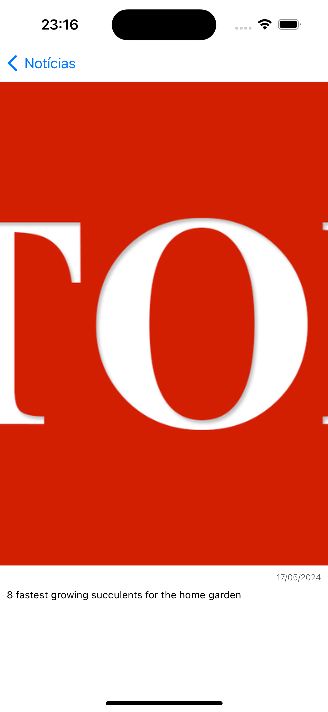

# Desafio-Bornlogic

O objetivo desse desafio é criar um aplicativo para leitura de notícias através da seguinte [API](https://newsapi.org).

## Tela inicial

A tela inicial possui uma lista de notícias em que cada célula exibe imagem, título, autor e descrição da notícia (quando disponíveis):

<kbd>
  
</kbd>

 
 

A tela inicial também permite selecionar diferentes categorias de notícia, selecionando na parte superior da tela:

<kbd>
  
</kbd>

## Tela de detalhes

A tela de detalhes é exibida ao clicar em uma das notícias na tela inicial, onde são exibidos imagem, data de publicação e conteúdo da notícia (quando disponíveis):

<kbd>
  
</kbd>
